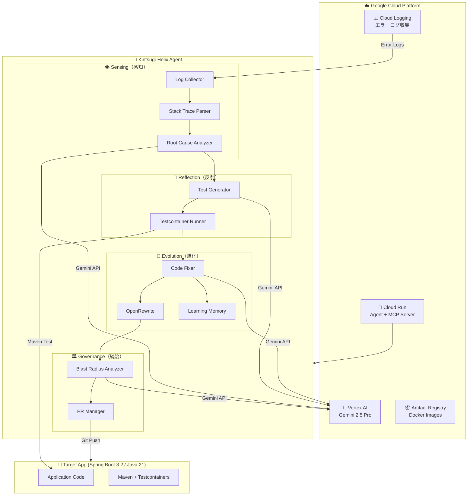

## TL;DR

「壊れた部分を金で修復し、より美しく仕上げる」金継ぎの哲学を、ソフトウェア障害回復に適用した自律型AIエージェント **Kintsugi-Helix** を開発しました。Vertex AI Gemini 2.5 Proを活用し、障害検知から修正・テスト・デプロイまでを人間の介入なしに実行します。

**リポジトリ**: https://github.com/hatyibei/kintsugi-helix
**ライブデモ**: https://kintsugi-helix-agent-541617236229.asia-northeast1.run.app/demo/

## デモ動画

@[youtube](PLACEHOLDER_VIDEO_ID)

## 金継ぎ（Kintsugi）とは

金継ぎとは、壊れた陶器を漆で接着し、金粉で装飾する日本の伝統的な修復技法です。単なる修理ではなく、**破損の歴史を隠さず、むしろ美として昇華させる**という哲学があります。

Kintsugi-Helixは、この哲学をソフトウェアに適用します：

> ソフトウェアの障害は「隠すべき傷」ではなく「改善と進化の機会」

## アーキテクチャ：4つの柱

Kintsugi-Helixは、4つの中核機能（柱）で構成されています。



**ライブデモ**: https://kintsugi-helix-agent-541617236229.asia-northeast1.run.app/demo/

### 1. Sensing（感知）- 障害の自動検出

Cloud Loggingからエラーログを収集し、Gemini 2.5 Proで**根本原因分析（Root Cause Analysis）** を実行します。

```python
@dataclass
class RootCauseAnalysis:
    """根本原因分析の結果"""
    summary: str              # 障害の概要
    root_cause: str           # 根本原因の詳細説明
    affected_component: str   # 修正が必要なコンポーネント
    suggested_fix: str        # 推奨される修正方法
    confidence: float         # 分析の確信度 (0.0-1.0)
    related_files: list[str]  # 関連ファイル一覧
    error_location: CodeLocation | None  # エラー発生箇所
    source_context: dict[str, str]       # ソースコードコンテキスト
```

ポイントは**スタックトレースの解析とソースコード抽出**です。エラーログからJavaのスタックフレームを解析し、対象リポジトリから関連するソースコードを自動取得。Geminiの100万トークンの長いコンテキストを活用し、コード全体を理解した上で根本原因を特定します。

### 2. Reflection（反射）- テストによるバグ再現

検出したバグを**JUnitテストで再現**します。Testcontainersを使用することで、データベースを含む完全な環境でテストを実行可能。

```python
@dataclass
class GeneratedTest:
    """生成されたテストケース"""
    class_name: str           # テストクラス名
    test_method_name: str     # テストメソッド名
    source_code: str          # テストのソースコード
    target_class: str         # テスト対象クラス
    expected_behavior: str    # 期待される振る舞い
    test_type: str            # bug_reproduction / regression / edge_case
```

このフェーズの重要な役割は「**バグが本当に存在することを証明する**」ことです。テストが失敗（バグ再現成功）してから修正フェーズに進みます。

### 3. Evolution（進化）- 自己修正ループ

バグが確認されたら、Geminiがコード修正を生成します。しかし、最初の修正が必ずしも正しいとは限りません。そこで**自己修正ループ**を実装しています。

```python
# Fix-Verify Loop: 修正 → テスト → フィードバック → 再修正
MAX_FIX_RETRIES = 3

for attempt in range(MAX_FIX_RETRIES):
    fix = await self.code_fixer.generate_fix(analysis, source_code, file_path)
    
    # テスト実行
    test_result = await self.test_runner.run_tests()
    
    if test_result.success:
        break  # 修正成功
    
    # テスト失敗時はフィードバックを基に再修正
    feedback = FixFeedback(
        error_type=test_result.error_type,
        error_message=test_result.error_message,
        failed_test=test_result.failed_test,
    )
    fix = await self.code_fixer.generate_fix_with_feedback(
        analysis, source_code, file_path, feedback
    )
```

さらに、OpenRewriteによる**構造的リファクタリング**も実行。単なるバグ修正にとどまらず、コードの品質向上も行います。

### 4. Governance（統治）- 安全な自動マージ

修正の**影響範囲（Blast Radius）** を分析し、リスクレベルに応じて処理を分岐します。

```python
@dataclass
class BlastRadiusResult:
    score: float              # 0.0-1.0（リスクスコア）
    risk_level: str           # low / medium / high / critical
    files_affected: int       # 影響を受けるファイル数
    dependencies_affected: list[str]  # 影響を受ける依存関係
    recommendation: str       # auto_merge / fast_review / full_review
    business_impact: BusinessImpact  # ビジネスへの影響評価
```

| リスクレベル | 対応 |
|-------------|------|
| Low (< 0.3) | **Auto-merge**: 自動でマージ |
| Medium (0.3-0.6) | **Fast Review**: 簡易レビュー付きPR |
| High (> 0.6) | **Full Review**: 完全なコードレビューPR |

依存グラフを解析し、変更がどこまで波及するかをGeminiが判断。低リスクな修正は即座に適用し、高リスクな修正は人間のレビューを挟むことで、**自動化と安全性のバランス**を取っています。

## 学習する免疫システム

Kintsugi-Helixの特徴的な機能が**Learning Memory（免疫記憶）** です。

```python
class LearningMemory:
    """過去の修正経験から学習する免疫システム"""
    
    def record_success(self, fix: CodeFix, analysis: RootCauseAnalysis):
        """成功した修正パターンを記録"""
        entry = LearningEntry(
            bug_type=analysis.affected_component,
            successful_fix_pattern=self._extract_pattern(fix),
            key_insight=self._generate_insight(fix, analysis),
        )
        self.knowledge.entries.append(entry)
    
    def record_failure(self, fix: CodeFix, feedback: FixFeedback):
        """失敗した修正を教訓として記録"""
        self.knowledge.anti_patterns.append({
            "failed_approach": fix.description,
            "why_failed": feedback.error_message,
            "lesson_learned": self._extract_lesson(feedback),
        })
```

成功・失敗の両方から学習し、`KNOWLEDGE_BASE.json`に永続化。次回以降の修正精度が向上していきます。まさに**Antifragile（反脆弱性）** の概念を実装しています。

## MCPサーバー：エコシステムへの接続

Kintsugi-Helixは**MCP（Model Context Protocol）サーバー**として機能し、外部エージェントと連携できます。

```python
# MCP Server エンドポイント
app = FastAPI(title="Kintsugi-Helix MCP Server")

@app.post("/tools/analyze_incident")
async def analyze_incident(request: AnalyzeIncidentRequest):
    """インシデントを分析し、根本原因を返す"""
    ...

@app.post("/tools/get_code_context")
async def get_code_context(request: GetCodeContextRequest):
    """ファイルのコードコンテキストを取得"""
    ...

@app.post("/tools/get_dependency_graph")
async def get_dependency_graph(request: GetDependencyGraphRequest):
    """クラスの依存グラフを取得"""
    ...
```

これにより、GitHub Copilotなどの他のAIエージェントから呼び出し可能。**エージェント同士が協調して問題を解決する**アーキテクチャを実現しています。

## 使用したGoogle Cloudサービス

### Vertex AI（Gemini 2.5 Pro/Flash）

本プロジェクトの中核。以下の用途で活用：

- **根本原因分析**: スタックトレースとソースコードを入力し、バグの原因を特定
- **テスト生成**: バグを再現するJUnitテストコードを生成
- **コード修正**: バグを修正するコードパッチを生成
- **影響範囲分析**: 修正の波及効果を依存グラフから判断

Gemini 2.5 Proの**100万トークンコンテキスト**が威力を発揮。プロジェクト全体のソースコードを一度に入力し、コンテキストを理解した上で適切な修正を提案できます。

### Cloud Logging

エラーログの収集元。`google-cloud-logging` クライアントでログをストリーミング取得し、エラーパターンを分析します。

```python
class LogCollector:
    def collect_errors(self, hours: int = 24) -> list[LogEntry]:
        filter_str = f'''
        severity>=ERROR
        resource.type="cloud_run_revision"
        timestamp>="{start_time}"
        '''
        return list(self.client.list_entries(filter_=filter_str))
```

### Cloud Run

エージェント自体をCloud Run上でホスト。スケーラブルかつサーバーレスで運用できます。

**デプロイURL**: https://kintsugi-helix-agent-541617236229.asia-northeast1.run.app

### Artifact Registry

コンテナイメージの保管に使用。CI/CDパイプラインからビルド・プッシュしています。

## 技術スタック

| カテゴリ | 技術 |
|----------|------|
| Agent Core | Python 3.11+, Vertex AI SDK, FastAPI |
| AI Model | Gemini 2.5 Pro / Flash |
| Target App | Java 21, Spring Boot 3.2 |
| Testing | Testcontainers, JUnit 5 |
| Refactoring | OpenRewrite |
| Infrastructure | Cloud Run, Terraform |
| Protocol | MCP (Model Context Protocol) |

## なぜ「Agentic AI」か

Kintsugi-Helixは、以下の点で**真にAgentic**です：

1. **自律性**: 障害検知から修正・デプロイまで、人間の介入なしに完結
2. **推論能力**: 単なるパターンマッチではなく、Geminiによる深い原因推論
3. **自己修正**: 修正が失敗したら自らフィードバックを取り込み再試行
4. **学習**: 経験を蓄積し、同種の問題に対して精度が向上
5. **判断**: リスクを評価し、自動処理か人間エスカレーションかを自ら決定

## 今後の展望

- **マルチ言語対応**: 現在はJava専用だが、TypeScript/Python/Go対応を計画
- **予防的修正**: 障害発生前にリスクの高いコードを検出・改善
- **エージェント連携強化**: 複数のKintsugiインスタンスが協調する分散修復

## まとめ

金継ぎの哲学「破損を美に変える」を実装したKintsugi-Helixは、障害を隠蔽するのではなく、そこから学び進化するソフトウェアを目指しています。

Vertex AI Geminiの強力な推論能力と、Cloud Loggingによるシームレスなログ連携。Google Cloudのエコシステムがあってこそ実現できた、次世代の自律型AIエージェントです。

**壊れることは、より強くなるための機会である。**

---

リポジトリ: https://github.com/hatyibei/kintsugi-helix
